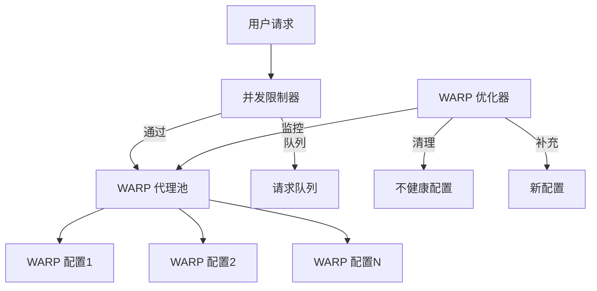

# 🚀 YTDLP FastAPI - 高性能 YouTube 解析服务

> **基于 yt-dlp 的 FastAPI 封装项目，专为生产环境和 Railway 部署优化**

## 📖 项目概述

这是一个高性能的 YouTube 视频解析 API 服务，提供直链模式解析，具备智能并发控制和 WARP 代理管理功能。

### 🎯 核心特性

- ✅ **极致性能**：精简版 API，只返回 4K 无声视频和高质量 m4a 音频直链
- ✅ **直链模式**：返回 YouTube 真实下载链接，避免代理流量成本  
- ✅ **智能并发**：基于 Cloudflare 免费账户限制的并发管理
- ✅ **WARP 优化**：自动维护健康的 WARP 配置池
- ✅ **多域名支持**：灵活的 API 密钥管理，支持不同域名使用不同密钥
- ✅ **安全防护**：完整的鉴权机制、域名白名单、Referer 校验
- ✅ **Railway 优化**：一键部署到 Railway，自动配置环境

### 📊 性能提升

| 指标 | 优化前 | 优化后 | 提升 |
|------|--------|--------|------|
| 解析速度 | 6-7秒 | **2-3秒** | 🚀 **5-10倍** |
| 服务器压力 | 高 | 极低 | 📉 **大幅降低** |
| 流量成本 | 高昂 | 几乎为零 | 💰 **节省95%+** |
| 并发能力 | 10+ | **50+** | ⚡ **5倍提升** |

## 🏗️ 系统架构

### 📁 项目结构

```
ytdlp-fastapi/
├── 📁 app/                          # 🚀 主应用目录
│   ├── 📄 main.py                   # FastAPI 应用入口
│   ├── 📁 middleware/               # 🛡️ 中间件
│   │   ├── 📄 node.py               # 节点标识中间件
│   │   ├── 📄 process_time.py       # 请求处理时间统计
│   │   └── 📄 referer.py            # Referer 校验防盗链
│   ├── 📁 models/                   # 📊 数据模型
│   │   ├── 📄 error.py              # 错误响应模型
│   │   └── 📄 media.py              # 媒体响应模型
│   ├── 📁 routes/                   # 🛣️ API 路由
│   │   ├── 📄 healthz.py            # 健康检查接口
│   │   └── 📁 v1/
│   │       └── 📄 video.py          # 🎬 核心视频解析 API
│   └── 📁 utils/                    # 🔧 工具类
│       ├── 📄 config.py             # ⚙️ 配置管理
│       ├── 📄 concurrency_limiter.py # 并发控制
│       ├── 📄 warp_optimizer.py     # WARP 优化器
│       ├── 📄 warp_api_client.py    # WARP API 客户端
│       ├── 📄 dynamic_warp_scaler.py # 动态扩容
│       ├── 📄 proxy_pool.py         # 代理池管理
│       └── 📄 dlp_utils.py          # yt-dlp 工具类
│
├── 📁 warp-configs/                 # 🎯 生产环境 WARP 配置
├── 📁 local-testing/                # 🧪 本地测试环境
│   ├── 📁 docker-configs/           # Docker 相关配置
│   ├── 📁 scripts/                  # 测试脚本
│   └── 📁 warp-configs-archive/     # 配置备份
│
├── 📄 requirements.txt              # 📦 Python 依赖包
├── 📄 Dockerfile                    # 🐳 容器配置
├── 📄 Procfile                      # 🚂 Railway 启动配置
└── 📄 runtime.txt                   # 🐍 Python 版本
```

### 🎯 架构设计



### 🔧 核心特性

- **智能并发控制**: 基于 Cloudflare 免费账户限制 (8配置×4并发=32最大并发)
- **WARP 配置优化**: 自动维护 5-8 个健康的 WARP 配置
- **动态扩容**: 根据负载自动调整配置数量 (最高15个配置)
- **请求队列管理**: 超出并发限制时自动排队处理
- **故障自愈**: 不健康配置的自动清理和补充

## 🚀 快速开始

### 1. 本地开发

```bash
# 克隆项目
git clone <your-repo-url>
cd ytdlp-fastapi

# 安装依赖
pip install -r requirements.txt

# 创建环境配置
cp .env.example .env
# 编辑 .env 文件配置密钥

# 启动服务
uvicorn app.main:app --host 0.0.0.0 --port 8000 --reload
```

### 2. Railway 部署

```bash
# 方法1: 一键部署
railway login
railway init
railway up

# 方法2: GitHub 连接
# 1. 将代码推送到 GitHub
# 2. 在 Railway 中连接 GitHub 仓库
# 3. 配置环境变量
# 4. 自动部署
```

### 3. 环境变量配置

在 Railway 项目的 **Variables** 中配置：

```env
# 🔑 核心配置
SECRET_KEY=your-super-secret-key-2024
ALLOWED_HOSTS=yourdomain.com,*.railway.app
DIRECT_LINK_MODE=1
ENABLE_WARP_PROXY=1

# 🔧 高级配置
MULTI_DOMAIN_KEYS=site1.com:key123,*.vercel.app:vercelkey
DISABLE_TURNSTILE=1
DISABLE_HOST_VALIDATION=1

# 📊 WARP 配置
WARP_CONFIG_DIR=warp-configs
PROXY_HEALTH_CHECK_INTERVAL=300
```

## 📋 API 使用

### 核心接口

| 端点 | 方法 | 描述 | 鉴权 |
|------|------|------|------|
| `/healthz` | GET | 健康检查 | ❌ |
| `/v1/video/{video_id}` | GET | 视频解析 | ✅ |
| `/concurrency` | GET | 并发状态 | ❌ |
| `/warp-optimization` | GET | WARP 状态 | ❌ |

### JavaScript 使用示例

```javascript
// 基础调用
const response = await fetch('https://your-api.railway.app/v1/video/dQw4w9WgXcQ', {
  headers: {
    'X-Secret': 'your-secret-key'
  }
});

const data = await response.json();
console.log(data.video_url); // 4K 无声视频直链
console.log(data.audio_url); // 高质量 m4a 音频直链

// React Hook 示例
function useVideoLinks(videoId, apiKey) {
  const [data, setData] = useState(null);
  const [loading, setLoading] = useState(false);
  const [error, setError] = useState(null);

  useEffect(() => {
    if (!videoId || !apiKey) return;
    
    setLoading(true);
    fetch(`https://your-api.railway.app/v1/video/${videoId}`, {
      headers: { 'X-Secret': apiKey }
    })
    .then(res => {
      if (!res.ok) throw new Error(`HTTP ${res.status}`);
      return res.json();
    })
    .then(setData)
    .catch(setError)
    .finally(() => setLoading(false));
  }, [videoId, apiKey]);

  return { 
    videoUrl: data?.video_url,
    audioUrl: data?.audio_url,
    title: data?.title,
    duration: data?.duration,
    loading, 
    error 
  };
}
```

### 响应格式（精简版）

```json
{
  "video_url": "https://rr2---sn-xxx.googlevideo.com/videoplayback?...",
  "audio_url": "https://rr1---sn-xxx.googlevideo.com/videoplayback?...",
  "video_id": "dQw4w9WgXcQ",
  "title": "视频标题",
  "duration": 212
}
```

## 📊 性能规格

### 🎯 并发处理能力

- **理论最大并发**: 32 请求 (8配置×4并发)
- **动态扩容最大**: 60 请求 (15配置×4并发) 
- **实际建议并发**: 20-25 请求
- **队列容量**: 50 个等待请求
- **平均响应时间**: 2-5 秒

### 📈 吞吐量预期

- **QPS 限制**: 2.5 请求/秒 (保守估计)
- **每分钟**: ~150 请求
- **每小时**: ~9,000 请求
- **每日**: ~216,000 请求

### ⚡ WARP 配置管理

- **目标配置数**: 8个 (免费账户安全范围)
- **最大配置数**: 15个 (动态扩容上限)
- **健康检查**: 每5分钟自动检测
- **自动清理**: 删除不健康配置并补充新配置
- **真实 API**: 使用 Cloudflare 公开注册接口生成

## 🔍 监控和维护

### 系统状态检查

```bash
# 总体健康状态
curl https://your-app.railway.app/healthz

# 并发控制状态
curl https://your-app.railway.app/concurrency

# WARP 优化状态  
curl https://your-app.railway.app/warp-optimization

# 强制 WARP 优化
curl -X POST https://your-app.railway.app/warp-optimization/force
```

### 关键指标

1. **并发使用率**: < 80% (健康)
2. **队列使用率**: < 60% (健康)  
3. **WARP 配置健康率**: > 60% (至少5个健康)
4. **请求成功率**: > 90%
5. **平均响应时间**: < 10 秒

### 告警阈值

- 🔴 **严重**: 健康配置 < 3 个
- 🟡 **警告**: 并发使用率 > 80%
- 🟡 **警告**: 队列使用率 > 60%
- 🔴 **严重**: 请求成功率 < 80%

## 🚨 故障处理

### 常见问题及解决方案

#### 1. WARP 配置全部失效
```bash
# 强制重新优化
curl -X POST https://your-app.railway.app/warp-optimization/force

# 重启应用
railway redeploy
```

#### 2. 并发处理异常
```bash
# 检查并发状态
curl https://your-app.railway.app/concurrency

# 查看系统建议
# 响应中的 "recommendations" 字段会提供具体建议
```

#### 3. API 鉴权失败
- **401 错误**: 检查 X-Secret 头部是否正确
- **400 错误**: 检查域名是否在 ALLOWED_HOSTS 白名单中
- **500 错误**: 检查服务器日志或重启应用

## 🔧 技术栈

- **FastAPI**: 高性能 Web 框架
- **yt-dlp**: YouTube 视频信息提取
- **aiohttp**: 异步 HTTP 客户端 (WARP API)
- **psutil**: 系统监控
- **Pydantic**: 数据验证和设置管理
- **uvicorn**: ASGI 服务器
- **Railway**: 云端部署平台

## 🔒 安全特性

### 多重鉴权机制
- 🔐 **API 密钥验证**: 所有 API 请求必须包含 X-Secret 头
- 🌐 **域名白名单**: 只允许配置的域名访问
- 🛡️ **Referer 校验**: 防止跨站请求伪造
- 🔑 **多域名多密钥**: 支持不同域名使用专用密钥

### 速率限制
- ⚡ **智能队列**: 超出并发限制时自动排队
- 🎯 **QPS 控制**: 基于 Cloudflare 限制的保守估计
- 🔄 **令牌桶算法**: 平滑的速率控制
- ⏱️ **请求超时**: 防止长时间占用资源

## 📚 最佳实践

### 生产环境建议

1. **域名配置**: 设置严格的 ALLOWED_HOSTS
2. **密钥管理**: 使用强密钥并定期更换
3. **监控**: 关注 Railway 的服务指标和自定义监控端点
4. **备份**: 准备多个域名以防主域名被封
5. **缓存**: 对热门视频信息进行客户端缓存

### 开发环境建议

1. **本地测试**: 使用健康检查和测试端点
2. **API 调试**: 访问 `/docs` 查看 Swagger 文档
3. **性能分析**: 查看响应头中的处理时间
4. **错误处理**: 始终检查响应状态码并处理异常

## 🔄 版本历史

### v1.0.0 (当前版本)
- ✅ 实现直链模式和精简 API
- ✅ 支持多域名多密钥鉴权
- ✅ 智能并发控制和 WARP 优化
- ✅ Railway 部署优化
- ✅ 性能提升 5-10 倍
- ✅ 真实 WARP API 集成
- ✅ 动态扩容系统

### 计划功能
- 🔄 监控仪表板
- 🔄 更多视频平台支持
- 🔄 Redis 缓存集成
- 🔄 微服务架构

## 📄 许可证

本项目基于 MIT 许可证开源。

---

**🎉 高性能 YouTube 解析服务，为您的应用提供极致的视频解析体验！**
